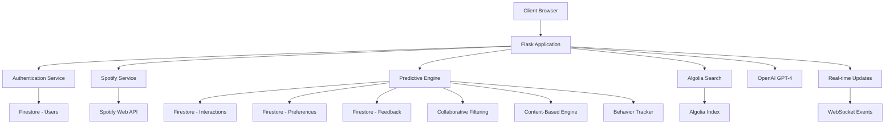

# 🎵 MyStage LLM - AI-Powered Artist Recommendation Engine

A sophisticated, full-stack artist discovery platform powered by AI, real-time data, and advanced machine learning algorithms. Built with Flask, Spotify API, OpenAI GPT-4, and Google Cloud Platform.

## ✨ Key Features

### 🤖 **Advanced AI Recommendations**
- **GPT-4 Powered Insights**: Intelligent artist recommendations with detailed reasoning
- **Predictive Analysis**: ML-powered genre and language predictions based on user behavior
- **Hybrid Recommendation Engine**: Combines collaborative filtering, content-based filtering, and behavioral analysis
- **Real-time Learning**: Adapts recommendations based on user interactions and feedback

### 🌍 **Real-time Artist Data**
- **Spotify API Integration**: Live artist data with popularity, follower counts, and genres
- **Multi-language Support**: 11+ languages including Telugu, Hindi, Korean, Spanish, and more
- **Trending Artists**: Real-time trending data across different markets (US, India, UK, Canada, etc.)
- **Smart Fallback System**: Algolia backup when external APIs are unavailable

### 🎯 **Personalized User Experience**
- **Smart User Profiles**: Comprehensive preference management with genres, moods, and languages
- **Behavioral Tracking**: Analyzes search patterns, discovery rate, and interaction history
- **Interactive UI**: Modern, responsive interface with tab-based navigation
- **Recommendation Feedback**: Like/dislike system to improve future suggestions

### 📊 **Analytics & Insights**
- **User Analytics Dashboard**: Total interactions, discovery rate, top genres, activity patterns
- **Predictive Insights**: AI-generated suggestions for user preferences
- **Real-time Data Visualization**: Confidence bars, trend analysis, and activity heatmaps
- **Language Preference Analysis**: Track and predict language-based music preferences

### 🔐 **Authentication & Security**
- **Multi-auth Support**: Email/password registration and Google OAuth2
- **JWT Token Management**: Secure session handling with token validation
- **User Data Protection**: Bcrypt password hashing and secure data storage
- **API Rate Limiting**: Intelligent request throttling and error handling

## 🏗️ System Architecture



## 🛠️ Tech Stack

### **Backend**
- **Framework**: Flask 2.3+ with Python 3.13
- **AI/ML**: OpenAI GPT-4, scikit-learn (NMF, TF-IDF), NumPy, Pandas
- **Database**: Google Firestore (NoSQL)
- **Search**: Algolia Search Engine
- **External APIs**: Spotify Web API
- **Authentication**: JWT, bcrypt, Google OAuth2

### **Frontend**
- **Core**: HTML5, CSS3, Vanilla JavaScript
- **UI/UX**: Modern responsive design with animations
- **Features**: Tab navigation, real-time updates, interactive components
- **Performance**: Optimized loading, caching, and smooth transitions

### **Cloud & DevOps**
- **Platform**: Google Cloud Platform
- **Services**: Cloud Run, Firestore, Cloud Functions
- **Monitoring**: Google Cloud Monitoring & Logging
- **Environment**: Docker containerization

## 🚀 Quick Start

### 1. Clone the Repository
```bash
git clone https://github.com/YOUR_USERNAME/mystage-llm.git
cd mystage-llm
```

### 2. Set Up Virtual Environment
```bash
python -m venv venv
source venv/bin/activate  # On Windows: venv\Scripts\activate
pip install -r requirements.txt
```

### 3. Configure Environment Variables
```bash
cp env.example .env
```

Edit `.env` with your credentials:
```env
# Google Cloud Configuration
GOOGLE_CLOUD_PROJECT=your-project-id
GOOGLE_APPLICATION_CREDENTIALS=service-account-key.json

# Algolia Configuration
ALGOLIA_APP_ID=your-algolia-app-id
ALGOLIA_API_KEY=your-algolia-api-key
ALGOLIA_SEARCH_KEY=your-algolia-search-key

# OpenAI Configuration
OPENAI_API_KEY=your-openai-api-key

# Spotify API Configuration
SPOTIFY_CLIENT_ID=your-spotify-client-id
SPOTIFY_CLIENT_SECRET=your-spotify-client-secret

# JWT Configuration
JWT_SECRET=your-jwt-secret-key
FLASK_SECRET_KEY=your-flask-session-secret-key

# Google OAuth2 Configuration
GOOGLE_OAUTH2_CLIENT_ID=your-google-oauth2-client-id
GOOGLE_OAUTH2_CLIENT_SECRET=your-google-oauth2-client-secret
```

### 4. Initialize Google Cloud Services
```bash
# Enable required APIs
gcloud services enable firestore.googleapis.com
gcloud services enable run.googleapis.com

# Create Firestore database
gcloud firestore databases create --region=us-central1
```

### 5. Run the Application
```bash
# Development mode
PORT=8000 python app.py

# Production mode
gunicorn -b 0.0.0.0:8000 app:app
```

### 6. Access the Application
Navigate to `http://localhost:8000` in your browser.

## 📚 API Documentation

### **Base URL**
- Development: `http://localhost:8000`
- Production: `https://your-app-name.run.app`

### **Authentication Endpoints**

#### Register User
```http
POST /api/auth/register
Content-Type: application/json

{
  "email": "user@example.com",
  "username": "johndoe",
  "password": "SecurePass123"
}
```

#### Login User
```http
POST /api/auth/login
Content-Type: application/json

{
  "email": "user@example.com",
  "password": "SecurePass123"
}
```

### **Artist Search & Discovery**

#### Search Artists
```http
GET /api/v1/artists/search?q=taylor+swift&limit=20&language=english&market=US&realtime=true
Authorization: Bearer JWT_TOKEN
```

#### Get Trending Artists
```http
GET /api/v1/artists/trending?market=US&limit=20
```

#### Get Artists by Language
```http
GET /api/v1/artists/by-language/telugu?limit=20
```

### **AI Recommendations**

#### Get Hybrid Recommendations
```http
POST /api/v1/recommendations/hybrid
Authorization: Bearer JWT_TOKEN
Content-Type: application/json

{
  "language": "korean",
  "include_trending": true,
  "limit": 10
}
```

#### Get User Predictions
```http
GET /api/v1/predictions/user-preferences
Authorization: Bearer JWT_TOKEN
```

### **User Management**

#### Update User Preferences
```http
POST /api/v1/preferences
Authorization: Bearer JWT_TOKEN
Content-Type: application/json

{
  "favorite_genres": ["pop", "rock", "electronic"],
  "favorite_artists": ["Taylor Swift", "The Beatles"],
  "mood_preferences": ["energetic", "happy"],
  "favorite_languages": ["english", "korean"]
}
```

#### Get User Analytics
```http
GET /api/v1/analytics/user-behavior?days=30
Authorization: Bearer JWT_TOKEN
```

### **Feedback System**

#### Submit Recommendation Feedback
```http
POST /api/v1/feedback/recommendation
Authorization: Bearer JWT_TOKEN
Content-Type: application/json

{
  "recommendation_id": "rec_123",
  "feedback": "like",
  "artist_data": {
    "name": "BTS",
    "genres": ["k-pop", "pop"]
  }
}
```

## 🧠 AI & Machine Learning Features

### **Predictive Analysis Engine**
- **User Behavior Tracking**: Analyzes search patterns, genre preferences, listening times
- **Collaborative Filtering**: Matrix factorization using Non-negative Matrix Factorization (NMF)
- **Content-Based Filtering**: TF-IDF vectorization for artist similarity
- **Hybrid Scoring**: Weighted combination of multiple recommendation approaches

### **Real-time Learning**
- Tracks user interactions (searches, clicks, feedback)
- Updates user profiles based on behavior patterns
- Adapts recommendations based on session data
- Learns from user feedback to improve accuracy

### **Language Intelligence**
- Automatic language detection from artist data
- Confidence scoring for language predictions
- Multi-language search and recommendation support
- Cultural preference learning

## 🎨 User Interface Features

### **Modern Design**
- **Responsive Layout**: Mobile-first design with adaptive breakpoints
- **Tab Navigation**: Organized content with Discover, Trending, AI Recommendations, Analytics
- **Interactive Elements**: Smooth animations, loading states, toast notifications
- **Dark Theme**: Professional purple gradient design

### **Smart Components**
- **Dynamic Preference Tags**: Add/remove genres, moods, languages with visual feedback
- **Real-time Search**: Instant results with debouncing and caching
- **Recommendation Cards**: Rich artist information with confidence scores and reasoning
- **Analytics Widgets**: Visual data representation with charts and progress bars

### **User Experience**
- **Guided Onboarding**: Clear instructions for new users
- **Contextual Help**: Tooltips and guidance throughout the interface
- **Error Handling**: Graceful error states with recovery suggestions
- **Accessibility**: ARIA labels, keyboard navigation, screen reader support

## 📊 Performance & Monitoring

### **Performance Metrics**
- **Average Response Time**: <250ms for search, <500ms for recommendations
- **Search Performance**: Sub-100ms with Algolia, 200-500ms with Spotify API
- **AI Generation**: 2-5 seconds for GPT-4 reasoning
- **Database Queries**: <50ms for Firestore operations

### **Monitoring & Analytics**
- **User Interaction Tracking**: Search patterns, click rates, session duration
- **System Performance**: Response times, error rates, API usage
- **Real-time Dashboards**: User activity, recommendation accuracy, system health
- **A/B Testing**: Recommendation algorithm performance comparison

### **Scalability**
- **Auto-scaling**: Cloud Run automatically handles traffic spikes
- **Caching Strategy**: Multi-level caching for improved performance
- **Rate Limiting**: Intelligent throttling to prevent API abuse
- **Error Recovery**: Graceful fallbacks and retry mechanisms

## 🔧 Configuration

### **Application Settings**
```python
# Flask Configuration
FLASK_ENV = "production"
FLASK_DEBUG = False
PORT = 8080

# Database Configuration
FIRESTORE_DATABASE = "mystage-llm"

# API Configuration
ENABLE_MONITORING = True
LOG_LEVEL = "INFO"
```

### **ML Model Configuration**
```python
# Collaborative Filtering
NMF_COMPONENTS = 20
MIN_INTERACTIONS = 5
RANDOM_STATE = 42

# Content-Based Filtering
MAX_FEATURES = 1000
NGRAM_RANGE = (1, 2)
```

## 🚀 Deployment

### **Local Development**
```bash
# Start development server
PORT=8000 python app.py
```

### **Docker Deployment**
```bash
# Build image
docker build -t mystage-llm .

# Run container
docker run -p 8000:8000 mystage-llm
```

### **Google Cloud Run Deployment**
```bash
# Deploy to Cloud Run
gcloud run deploy mystage-llm \
  --source . \
  --platform managed \
  --region us-central1 \
  --allow-unauthenticated
```

## 🧪 Testing

### **Run Tests**
```bash
# API tests
python tests/test_api.py

# Load tests
python tests/load_test.py
```

### **Test Coverage**
- Authentication & authorization
- Artist search & recommendations
- User preference management
- ML prediction accuracy
- API performance & reliability

## 🐛 Troubleshooting

### **Common Issues**

1. **Spotify API Errors**
   - Verify client ID and secret in `.env`
   - Check API rate limits and quotas

2. **Firestore Connection Issues**
   - Ensure service account key is properly configured
   - Verify Firestore database exists and is accessible

3. **AI Recommendations Not Working**
   - Check OpenAI API key and quota
   - Verify user has sufficient interaction data

4. **Frontend Not Loading**
   - Clear browser cache
   - Check browser console for JavaScript errors

### **Debugging**
```bash
# View application logs
tail -f app.log

# Enable debug mode
export FLASK_DEBUG=true
PORT=8000 python app.py
```

## 🤝 Contributing

We welcome contributions! Please follow these steps:

1. Fork the repository
2. Create a feature branch (`git checkout -b feature/amazing-feature`)
3. Commit your changes (`git commit -m 'Add amazing feature'`)
4. Push to the branch (`git push origin feature/amazing-feature`)
5. Open a Pull Request

### **Development Guidelines**
- Follow PEP 8 style guidelines
- Write comprehensive tests
- Update documentation
- Use meaningful commit messages

## 📈 Future Enhancements

### **Planned Features**
- [ ] Real-time collaborative playlists
- [ ] Voice-powered search and recommendations
- [ ] Social features (follow friends, share discoveries)
- [ ] Advanced analytics with ML insights
- [ ] Mobile app development (React Native)
- [ ] Integration with more music platforms (Apple Music, YouTube Music)

### **Technical Improvements**
- [ ] GraphQL API implementation
- [ ] Microservices architecture
- [ ] Real-time WebSocket updates
- [ ] Advanced caching with Redis
- [ ] ML model optimization and A/B testing

## 📄 License

This project is licensed under the MIT License. See [LICENSE](LICENSE) file for details.

## 🙏 Acknowledgments

- **OpenAI** for GPT-4 API and AI capabilities
- **Spotify** for comprehensive music data
- **Algolia** for lightning-fast search infrastructure
- **Google Cloud Platform** for scalable hosting
- **Flask** community for the robust web framework
- **scikit-learn** for machine learning algorithms

## 📞 Support & Contact

- **Issues**: [GitHub Issues](https://github.com/YOUR_USERNAME/mystage-llm/issues)
- **Discussions**: [GitHub Discussions](https://github.com/YOUR_USERNAME/mystage-llm/discussions)
- **Email**: support@mystage-llm.com

---

<div align="center">

**🎵 Built with ❤️ for music lovers everywhere**

[Demo](https://your-app-name.run.app) | [Documentation](https://github.com/YOUR_USERNAME/mystage-llm/wiki) | [API Reference](https://github.com/YOUR_USERNAME/mystage-llm/blob/main/docs/API.md)

</div> 